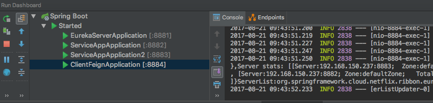
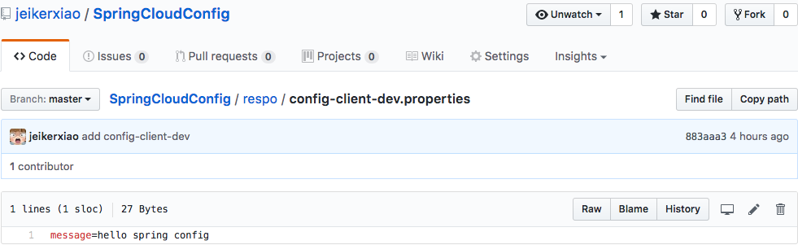
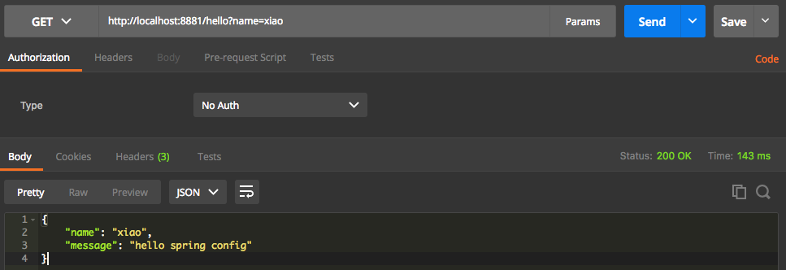

# Spring Cloud Study

Project for spring cloud learning.


# 1.spring-cloud-eureka

## 1.1.说明

Eureka 是一个服务注册和发现模块。

先创建1个maven主工程，然后创建2个model工程。

* 一个model工程为服务注册中心（Eureka Server）
* 一个model工程为服务发布 (Eureka Client)。


## 1.2.Eureka Server

pom.xml

```xml
<dependency>
    <groupId>org.springframework.cloud</groupId>
    <artifactId>spring-cloud-starter-eureka-server</artifactId>
</dependency>
```

application.yml配置文件

```yaml
server:
  port: 8771

eureka:
  instance:
    hostname: localhost
  client:
    register-with-eureka: false
    fetch-registry: false
    service-url:
      defaultZone: http://${eureka.instance.hostname}:${server.port}/eureka/


```

## 1.3.启动Eureka Server

启动Eureka Server 工程，浏览器打开下面地址：

http://localhost:8771


## 1.4.Eureka Client

pom.xml


```xml
<dependency>
    <groupId>org.springframework.cloud</groupId>
    <artifactId>spring-cloud-starter-eureka</artifactId>
</dependency>

<dependency>
    <groupId>org.springframework.boot</groupId>
    <artifactId>spring-boot-starter-web</artifactId>
</dependency>
```

application.yml配置文件


```yaml
server:
  port: 8772
  
spring:
  application:
    name: service-app1
    
eureka:
  client:
    service-url:
      defaultZone: http://localhost:8771/eureka/

```

application启动类：

```java
@SpringBootApplication
@EnableEurekaClient
@RestController
public class ServiceApp1Application {

	public static void main(String[] args) {
		SpringApplication.run(ServiceApp1Application.class, args);
	}

	@Value("${server.port}")
	String port;

	@GetMapping("/hello")
	@ResponseBody
	public Map<String, String> hello(@RequestParam String name) {
		Map<String, String> result = new HashMap<>();
		result.put("name", name);
		result.put("port", port);
		return result;
	}
}

```

## 1.5.启动Eureka Client

启动Eureka Server,然后启动Eureka Client 工程，浏览器打开下面地址：

http://localhost:8771


http://localhost:8772/hello?name=xiao


# 2.spring-cloud-ribbon

在微服务架构中，业务都会被拆分成一个独立的服务，服务与服务的通讯是基于Http RESTful的。

spring cloud有两种服务调用方式:

1. Ribbon+restTemplate
2. Feign

此项目介绍第1种服务调用方式，Ribbon是一个负载均衡客户端。

项目有三个模块：

1. eureka-server (服务发现)
2. service-app (服务生产者)
3. client-ribbon (服务消费者)

## 2.1 eureka-server (服务发现)

pom.xml

```xml
<dependency>
	<groupId>org.springframework.cloud</groupId>
	<artifactId>spring-cloud-starter-eureka-server</artifactId>
</dependency>
```

application.yml

```yaml
server:
  port: 8881

eureka:
  instance:
    hostname: localhost
  client:
    register-with-eureka: false
    fetch-registry: false
    service-url:
      defaultZone: http://${eureka.instance.hostname}:${server.port}/eureka/
```


## 2.2 service-app (服务生产者)

pom.xml

```xml
<dependency>
	<groupId>org.springframework.cloud</groupId>
	<artifactId>spring-cloud-starter-eureka</artifactId>
</dependency>
<dependency>
	<groupId>org.springframework.boot</groupId>
	<artifactId>spring-boot-starter-web</artifactId>
</dependency>
```

application.yml

```yaml
server:
  port: 8883

eureka:
  client:
    service-url:
      defaultZone: http://localhost:8881/eureka/

spring:
  application:
    name: service-app
```

## 2.3 client-ribbon (服务消费者)

pom.xml

```xml
<dependency>
	<groupId>org.springframework.cloud</groupId>
	<artifactId>spring-cloud-starter-eureka</artifactId>
</dependency>
<dependency>
	<groupId>org.springframework.cloud</groupId>
	<artifactId>spring-cloud-starter-ribbon</artifactId>
</dependency>
<dependency>
	<groupId>org.springframework.boot</groupId>
	<artifactId>spring-boot-starter-web</artifactId>
</dependency>
```

application.yml

```yaml
server:
  port: 8884
eureka:
  client:
    service-url:
      defaultZone: http://localhost:8881/eureka/
spring:
  application:
    name: service-ribbon
```

## 2.4 启动

启动顺序：

1. eureka-server (服务发现) 8881端口
2. service-app (服务生产者) 8882端口（启动两个相同服务，使用不同端口，模拟分布式部署）
3. service-app (服务生产者) 8883端口
4. client-ribbon (服务消费者) 8884端口


1.查看eureka-server启动

http://localhost:8881

2.查看service-app 第一个服务启动

http://localhost:8882/hello?name=xiao


3.查看service-app 第二个服务启动

http://localhost:8883/hello?name=xiao


4.查看client-ribbon 启动

可以一直请求，可以看到端口号 port 在服务1和服务2之间跳动。（负载均衡）

http://localhost:8884/hello?name=xiao


# 3.spring-cloud-feign

项目有三个模块：

1. eureka-server (服务发现)
2. service-app (服务生产者)
3. client-feign (服务消费者)

## 3.1 eureka-server (服务发现)

pom.xml

```xml
<dependency>
	<groupId>org.springframework.cloud</groupId>
	<artifactId>spring-cloud-starter-eureka-server</artifactId>
</dependency>
```

application.yml

```yaml
server:
  port: 8881

eureka:
  instance:
    hostname: localhost
  client:
    register-with-eureka: false
    fetch-registry: false
    service-url:
      defaultZone: http://${eureka.instance.hostname}:${server.port}/eureka/
```


## 3.2 service-app (服务生产者)

pom.xml

```xml
<dependency>
	<groupId>org.springframework.cloud</groupId>
	<artifactId>spring-cloud-starter-eureka</artifactId>
</dependency>
<dependency>
	<groupId>org.springframework.boot</groupId>
	<artifactId>spring-boot-starter-web</artifactId>
</dependency>
```

application.yml

```yaml
server:
  port: 8882
spring:
  application:
    name: service-app
eureka:
  client:
    service-url:
      defaultZone: http://localhost:8881/eureka/
```


## 3.3 client-feign (服务消费者)

pom.xml

```xml
<dependency>
	<groupId>org.springframework.cloud</groupId>
	<artifactId>spring-cloud-starter-eureka</artifactId>
</dependency>
<dependency>
	<groupId>org.springframework.cloud</groupId>
	<artifactId>spring-cloud-starter-feign</artifactId>
</dependency>
<dependency>
	<groupId>org.springframework.boot</groupId>
	<artifactId>spring-boot-starter-web</artifactId>
</dependency>
```

application.yml

```yaml
server:
  port: 8884
spring:
  application:
    name: service-fegin
eureka:
  client:
    service-url:
      defaultZone: http://localhost:8881/eurek
```

## 3.4 启动

启动顺序：

1. eureka-server (服务发现) 8881端口
2. service-app (服务生产者) 8882端口（启动两个相同服务，使用不同端口，模拟分布式部署）
3. service-app (服务生产者) 8883端口
4. client-feign (服务消费者) 8884端口




1.查看eureka-server启动

http://localhost:8881

2.查看service-app 第一个服务启动

http://localhost:8882/hello?name=xiao

3.查看service-app 第二个服务启动

http://localhost:8883/hello?name=xiao

4.查看client-feign 启动

可以一直请求，可以看到端口号 port 在服务1和服务2之间跳动。（负载均衡）

http://localhost:8884/hello?name=xiao

# 4.spring-cloud-ribbon-hystrix

Hystrix 断路器

在spring-cloud-ribbon项目基础上增加hystrix。

# 5.spring-cloud-feign-hystrix

Hystrix 断路器

在spring-cloud-feign项目基础上增加hystrix。

# 6.spring-cloud-zuul

Zuul的主要功能是路由转发和过滤器。

项目有三个模块：

1. eureka-server (服务发现)
2. service-app (服务生产者)
3. service-ribbon (服务消费者)
4. service-ribbon (服务消费者)
5. service-zuul (服务路由)

重点介绍 service-zuul 配置

## 6.1 service-zuul (服务路由)

pom.xml

```xml
<dependency>
	<groupId>org.springframework.cloud</groupId>
	<artifactId>spring-cloud-starter-eureka</artifactId>
</dependency>
<dependency>
	<groupId>org.springframework.cloud</groupId>
	<artifactId>spring-cloud-starter-zuul</artifactId>
</dependency>
<dependency>
	<groupId>org.springframework.boot</groupId>
	<artifactId>spring-boot-starter-web</artifactId>
</dependency>
```

application.yml

```yaml
server:
  port: 8886

spring:
  application:
    name: service-zuul
eureka:
  client:
    service-url:
      defaultZone: http://localhost:8881/eureka/
zuul:
  routes:
    api-a:
      path: /api-a/**
      serviceId: service-ribbon
    api-b:
      path: /api-b/**
      serviceId: service-feign
```

## 6.2 启动


在 Eureka 上查看所有服务：

http://localhost:8881

测试 zuul:

http://localhost:8886/api-a/hello?name=xiao&token=1

http://localhost:8886/api-b/hello?name=xiao&token=1


# 7. spring-cloud-config

在分布式系统中，由于服务数量巨多，为了方便服务配置文件统一管理，实时更新，所以需要分布式配置中心组件。

在 spring-cloud-config 组件中，分两个角色:

1. config server （服务器）
2. config client （客户端）

所以示例项目分两个模块：

1. config-server (配置服务器)
2. config-client (配置客户端)


## 7.1 config-server (配置服务器)

pom.xml

```xml
<dependency>
	<groupId>org.springframework.cloud</groupId>
	<artifactId>spring-cloud-starter-eureka</artifactId>
</dependency>
<dependency>
	<groupId>org.springframework.cloud</groupId>
	<artifactId>spring-cloud-config-server</artifactId>
</dependency>
```

application.yml

```yaml
server:
  port: 8888

spring:
  application:
    name: config-server
  cloud:
    config:
      server:
        git:
          uri: https://github.com/jeikerxiao/SpringCloudConfig/
          search-paths: respo
          username:   # 公开仓库可不写用户名和密码，私有仓库需要写
          password:
      label: master
```

## 7.2 config-client (配置客户端)

pom.xml

```xml
<dependency>
	<groupId>org.springframework.cloud</groupId>
	<artifactId>spring-cloud-starter-config</artifactId>
</dependency>
<dependency>
	<groupId>org.springframework.boot</groupId>
	<artifactId>spring-boot-starter-web</artifactId>
</dependency>
```

application.yml

```yaml
server:
  port: 8881

spring:
  application:
    name: config-client
  cloud:
    config:
      uri: http://localhost:8888/
      label: master
      profile: dev
```

HelloController.java

```java
@RestController
public class HelloController {

    @Value("${message}")
    String message;

    @GetMapping("/hello")
    public Map<String, String> hello(@RequestParam String name) {
        Map<String, String> result = new HashMap<>();
        result.put("name", name);
        result.put("message", message);
        return result;
    }

}

```

## 7.3 Git仓库上的配置文件

https://github.com/jeikerxiao/SpringCloudConfig/blob/master/respo/config-client-dev.properties



## 7.4 测试

http://localhost:8881/hello?name=xiao

