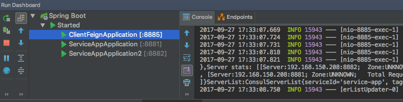
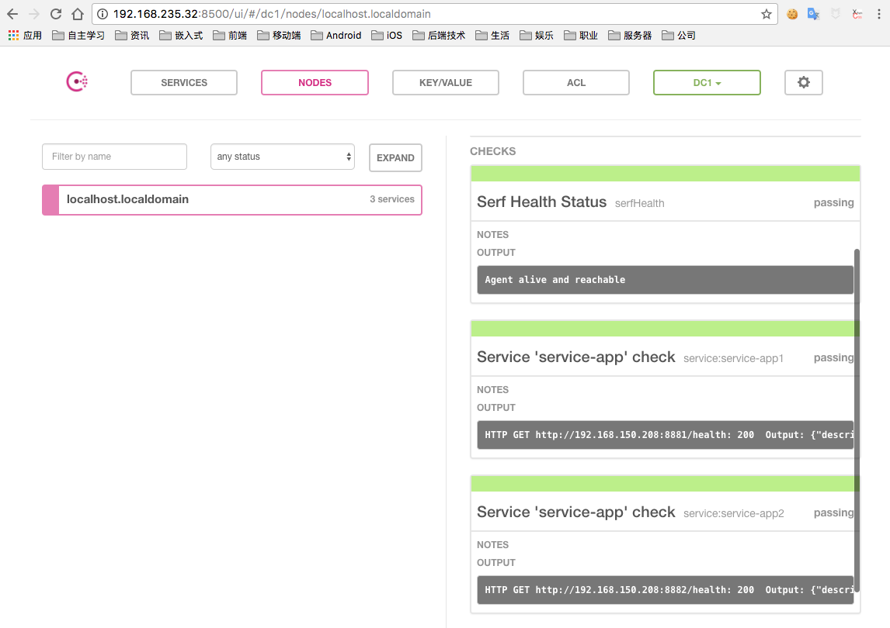
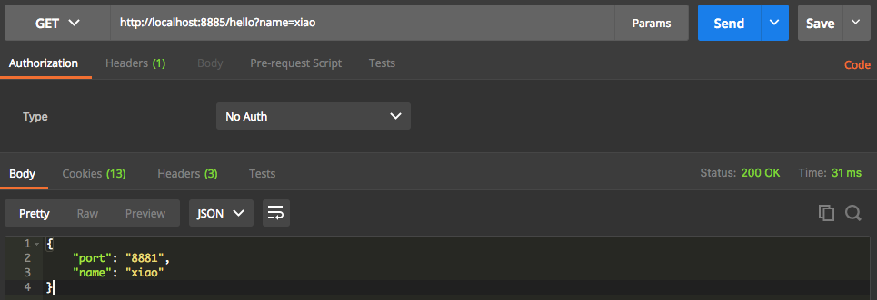

# spring-cloud-consul

## 说明

使用 consul 作为服务注册和服务发现。

使用二个项目：

1. service-app（服务提供者）
2. client-feign（服务消费者）

## service-app

pom.xml

```xml
<dependency>
	<groupId>org.springframework.cloud</groupId>
	<artifactId>spring-cloud-starter-config</artifactId>
</dependency>
<dependency>
	<groupId>org.springframework.cloud</groupId>
	<artifactId>spring-cloud-starter-consul-discovery</artifactId>
</dependency>

<dependency>
	<groupId>org.springframework.boot</groupId>
	<artifactId>spring-boot-starter-web</artifactId>
</dependency>
```

application.yml配置文件

```yaml
server:
  port: 8881

spring:
  application:
    name: service-app
  cloud:
    consul:
      host: 192.168.235.32
      port: 8500
      enabled: true
      discovery:
        hostname: 192.168.150.208
        port: ${server.port}
        enabled: true
        service-name: service-app
        instance-id: service-app1
        health-check-url: http://192.168.150.208:${server.port}/health
        health-check-interval: 10s
```

服务端接口

```java
@SpringBootApplication
@EnableDiscoveryClient
@RestController
public class ServiceAppApplication {

	public static void main(String[] args) {
		SpringApplication.run(ServiceAppApplication.class, args);
	}

	@Value("${server.port}")
	String port;

	@GetMapping("/hello")
	public Map<String, String> hello(@RequestParam String name) {
		Map<String, String> result = new HashMap<>();
		result.put("name", name);
		result.put("port", port);
		return result;
	}
}
```


## client-feign

pom.xml

```xml
<dependency>
	<groupId>org.springframework.cloud</groupId>
	<artifactId>spring-cloud-starter-config</artifactId>
</dependency>
<dependency>
	<groupId>org.springframework.cloud</groupId>
	<artifactId>spring-cloud-starter-consul-discovery</artifactId>
</dependency>

<dependency>
	<groupId>org.springframework.cloud</groupId>
	<artifactId>spring-cloud-starter-feign</artifactId>
</dependency>
<dependency>
	<groupId>org.springframework.cloud</groupId>
	<artifactId>spring-cloud-starter-hystrix</artifactId>
</dependency>
<dependency>
	<groupId>org.springframework.cloud</groupId>
	<artifactId>spring-cloud-starter-hystrix-dashboard</artifactId>
</dependency>

<dependency>
	<groupId>org.springframework.boot</groupId>
	<artifactId>spring-boot-starter-web</artifactId>
</dependency>
```

application.yml配置文件

因为是服务消费者，所以不注册服务到 consul 上。

```yaml
server:
  port: 8885
spring:
  application:
    name: client-fegin
  cloud:
    consul:
      host: 192.168.235.32
      port: 8500
      discovery:
        register: false
```

启动类配置

```java
@SpringBootApplication
@EnableDiscoveryClient
@EnableFeignClients
public class ClientFeignApplication {

	public static void main(String[] args) {
		SpringApplication.run(ClientFeignApplication.class, args);
	}
}
```

服务层

```java
@Component
@FeignClient(value = "service-app")
public interface HelloService {

    @GetMapping("/hello")
    Map<String, String> hello(@RequestParam(value = "name") String name);
}
```

web接口：

```java
@RestController
public class HelloController {

    @Autowired
    private HelloService helloService;

    @GetMapping("/hello")
    public Map<String, String> hello(@RequestParam String name) {
        return helloService.hello(name);
    }
}

```

## 启动服务

1. 启动 consul 服务器（我的：192.168.235.32:8500）
2. 启动 service-app 服务(实例1，和实例2，两个服务)
3. 启动 client-feign 服务

### 启动项目

* service-app 服务实例1 service-app1 端口号为 8881
* service-app 服务实例2 service-app2 端口号为 8882
* client-feign 客户端实例 client-feign 端口号为 8885




### consul 服务器

* http://192.168.235.32:8500

可以查看到service-app 已经注册了两个实例 service-app1 和 service-app2 ,并且两个实例都是绿色可用状态。



### 客户端调用

请求 client-feign 项目接口，会调用 service-app 接口：

可以试几次，会发现 port 端口号会在 8881 和 8882 之间跳动，也就说明分别调用了 service-app 的两个实例，进行了负载均衡。

* http://localhost:8885/hello?name=xiao



