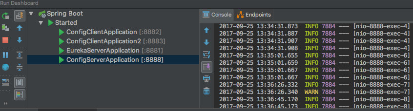
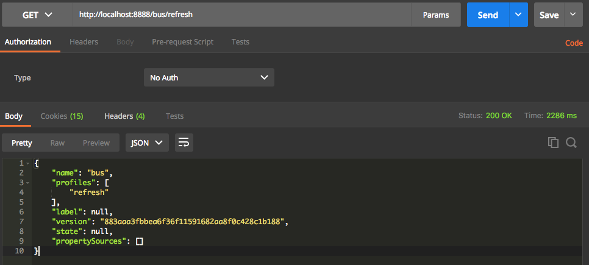

# spring-cloud-kafka

## 说明

使用三个项目：

1. eureka-server（服务注册与发现） 
2. config-server（配置服务器）
3. config-client（配置客户端）

## eureka-server

pom.xml

```xml
<dependency>
    <groupId>org.springframework.cloud</groupId>
    <artifactId>spring-cloud-starter-eureka-server</artifactId>
</dependency>
```

application.yml配置文件

```yaml
server:
  port: 8881

spring:
  application:
    name: eureka-server
eureka:
  instance:
    hostname: localhost
  client:
    register-with-eureka: false
    fetch-registry: false
    service-url:
      defaultZone: http://${eureka.instance.hostname}:${server.port}/eureka/

```

## config-server

pom.xml

```xml
<dependency>
	<groupId>org.springframework.cloud</groupId>
	<artifactId>spring-cloud-config-server</artifactId>
</dependency>

<dependency>
	<groupId>org.springframework.cloud</groupId>
	<artifactId>spring-cloud-starter-eureka</artifactId>
</dependency>
```

application.yml配置文件

```yaml
server:
  port: 8888

spring:
  application:
    name: config-server
  cloud:
    config:
      server:
        git:
          uri: https://github.com/jeikerxiao/SpringCloudConfig/
          search-paths: respo
          username:   # 公开仓库可不写用户名和密码，私有仓库需要写
          password:
      label: master

eureka:
  client:
    service-url:
      defaultZone: http://localhost:8881/eureka/

```

## config-client

pom.xml

```xml
<dependency>
	<groupId>org.springframework.cloud</groupId>
	<artifactId>spring-cloud-starter-config</artifactId>
</dependency>
<dependency>
	<groupId>org.springframework.cloud</groupId>
	<artifactId>spring-cloud-starter-eureka</artifactId>
</dependency>
<dependency>
	<groupId>org.springframework.cloud</groupId>
	<artifactId>spring-cloud-starter-bus-amqp</artifactId>
</dependency>
<dependency>
	<groupId>org.springframework.boot</groupId>
	<artifactId>spring-boot-starter-web</artifactId>
</dependency>
```

application.yml配置文件

```yaml
server:
  port: 8883

spring:
  application:
    name: config-client
  rabbitmq:
    host: 192.168.235.32
    port: 5672
    username: admin
    password: 123456
  cloud:
    config:
      label: master
      profile: dev
      discovery:
        enabled: true
        service-id: config-server
eureka:
  client:
    service-url:
      defaultZone: http://localhost:8881/eureka/

```

web接口：

```java
@RestController
public class HelloController {

    @Value("${message}")
    String message;

    @GetMapping("/hello")
    public Map<String, String> hello(@RequestParam String name) {
        Map<String, String> result = new HashMap<>();
        result.put("name", name);
        result.put("message", message);
        return result;
    }
}
```

## 启动服务

config-client启动两个实例：




请求config-server 发送配置刷新指令,刷新所有客户端配置：

* http://localhost:8888/bus/refresh



