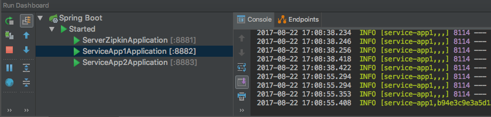
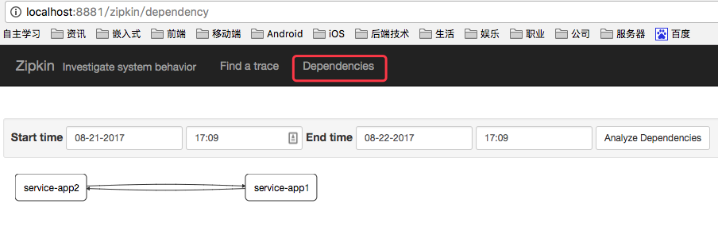

# 9 spring-cloud-zipkin

zipkin 是一个服务追踪组件，用于查找复杂的服务调用关系。

项目分三个模块：

1. server-zipkin (服务追踪)
2. service-app1 (服务1)
3. service-app2 (服务2)

## 9.1 server-zipkin (服务追踪)

pom.xml

```xml
<dependency>
	<groupId>io.zipkin.java</groupId>
	<artifactId>zipkin-server</artifactId>
</dependency>
<dependency>
	<groupId>io.zipkin.java</groupId>
	<artifactId>zipkin-autoconfigure-ui</artifactId>
	<scope>runtime</scope>
</dependency>
```

application.yml

```yaml
server:
  port: 8881
```

## 9.2 service-app1 (服务1)

pom.xml

```xml
<dependency>
	<groupId>org.springframework.cloud</groupId>
	<artifactId>spring-cloud-starter-zipkin</artifactId>
</dependency>
<dependency>
	<groupId>org.springframework.cloud</groupId>
	<artifactId>spring-boot-starter-web</artifactId>
</dependency>
```

application.yml

```yaml
server:
  port: 8882

spring:
  application:
    name: service-app1
  zipkin:
    base-url: http://localhost:8881
```

HelloController.java

```java
@RestController
public class HelloController {
    
    @Autowired
    private RestTemplate restTemplate;

    @GetMapping("/hello")
    public Map<String, String> hello(){
    	// 调用 service-app2 接口
        return restTemplate.getForObject("http://localhost:8883/message", Map.class);
    }

    @GetMapping("/message")
    public Map<String, String> message() {
        Map<String, String> result = new HashMap<>();
        result.put("message", "this is service-app1");
        return result;
    }
}

```

## 9.3 service-app2 (服务2)

pom.xml

```xml
<dependency>
	<groupId>org.springframework.cloud</groupId>
	<artifactId>spring-cloud-starter-zipkin</artifactId>
</dependency>
<dependency>
	<groupId>org.springframework.cloud</groupId>
	<artifactId>spring-boot-starter-web</artifactId>
</dependency>
```

application.yml

```yaml
server:
  port: 8883

spring:
  application:
    name: service-app1
  zipkin:
    base-url: http://localhost:8881
```

HelloController.java

```java
@RestController
public class HelloController {

    @Autowired
    private RestTemplate restTemplate;

    @GetMapping("/hello")
    public Map<String, String> hello(){
    	// 调用 service-app1 接口
        return restTemplate.getForObject("http://localhost:8882/message", Map.class);
    }

    @GetMapping("/message")
    public Map<String, String> message() {
        Map<String, String> result = new HashMap<>();
        result.put("message", "this is service-app2");
        return result;
    }
}
```

## 9.4 测试

启动顺序



请求接口：

http://localhost:8882/hello

http://localhost:8883/hello


查看依赖关系：

http://localhost:8881/zipkin/dependency


