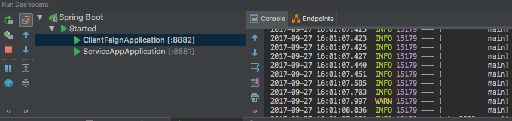
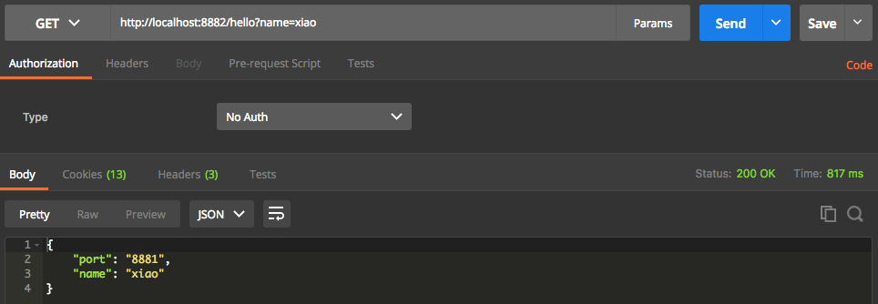

# spring-cloud-zookeeper

## 说明

使用 zookeeper 作为服务注册和服务发现。

使用二个项目：

1. service-app（服务提供者）
2. client-feign（服务消费者）

## service-app

pom.xml

```xml
<dependency>
	<groupId>org.springframework.cloud</groupId>
	<artifactId>spring-cloud-starter-config</artifactId>
</dependency>
<dependency>
	<groupId>org.springframework.cloud</groupId>
	<artifactId>spring-cloud-starter-zookeeper-discovery</artifactId>
</dependency>

<dependency>
	<groupId>org.springframework.boot</groupId>
	<artifactId>spring-boot-starter-web</artifactId>
</dependency>
```

application.yml配置文件

```yaml
server:
  port: 8881
spring:
  application:
    name: service-app
  cloud:
    zookeeper:
      connect-string: 192.168.235.32:2181
      discovery:
        instance-host: localhost
        instance-port: ${server.port}
```

服务端接口

```java
@SpringBootApplication
@EnableDiscoveryClient
@RestController
public class ServiceAppApplication {

	public static void main(String[] args) {
		SpringApplication.run(ServiceAppApplication.class, args);
	}

	@Value("${server.port}")
	String port;

	@GetMapping("/hello")
	public Map<String, String> hello(@RequestParam String name) {
		Map<String, String> result = new HashMap<>();
		result.put("name", name);
		result.put("port", port);
		return result;
	}
}
```


## client-feign

pom.xml

```xml
<dependency>
	<groupId>org.springframework.cloud</groupId>
	<artifactId>spring-cloud-starter-config</artifactId>
</dependency>
<dependency>
	<groupId>org.springframework.cloud</groupId>
	<artifactId>spring-cloud-starter-zookeeper-discovery</artifactId>
</dependency>

<dependency>
	<groupId>org.springframework.cloud</groupId>
	<artifactId>spring-cloud-starter-feign</artifactId>
</dependency>
<dependency>
	<groupId>org.springframework.cloud</groupId>
	<artifactId>spring-cloud-starter-hystrix</artifactId>
</dependency>
<dependency>
	<groupId>org.springframework.cloud</groupId>
	<artifactId>spring-cloud-starter-hystrix-dashboard</artifactId>
</dependency>

<dependency>
	<groupId>org.springframework.boot</groupId>
	<artifactId>spring-boot-starter-web</artifactId>
</dependency>
```

application.yml配置文件

```yaml
server:
  port: 8882
spring:
  application:
    name: service-fegin
  cloud:
    zookeeper:
      connect-string: 192.168.235.32:2181
```

启动类配置

```java
@SpringBootApplication
@EnableDiscoveryClient
@EnableFeignClients
public class ClientFeignApplication {

	public static void main(String[] args) {
		SpringApplication.run(ClientFeignApplication.class, args);
	}
}
```

服务层

```java
@Component
@FeignClient(value = "service-app")
public interface HelloService {

    @GetMapping("/hello")
    Map<String, String> hello(@RequestParam(value = "name") String name);
}
```

web接口：

```java
@RestController
public class HelloController {

    @Autowired
    private HelloService helloService;

    @GetMapping("/hello")
    public Map<String, String> hello(@RequestParam String name) {
        return helloService.hello(name);
    }
}

```

## 启动服务

1. 启动 zookeeper 服务器（我的：192.168.235.32:2181）
2. 启动 service-app 服务
3. 启动 client-feign 服务




请求 client-feign 项目接口，会调用 service-app 接口：

* http://localhost:8882/hello?name=xiao



