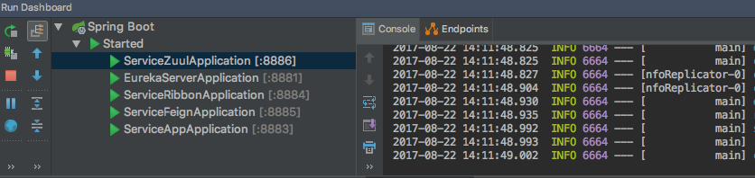
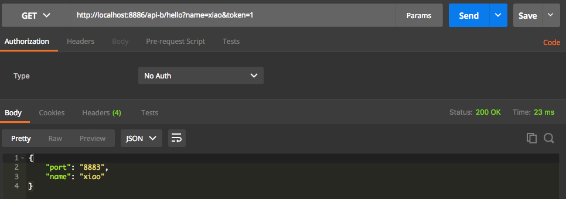

# 6.spring-cloud-zuul

Zuul的主要功能是路由转发和过滤器。

项目有三个模块：

1. eureka-server (服务发现)
2. service-app (服务生产者)
3. service-ribbon (服务消费者)
4. service-ribbon (服务消费者)
5. service-zuul (服务路由)

重点介绍 service-zuul 配置

## 6.1 service-zuul (服务路由)

pom.xml

```xml
<dependency>
	<groupId>org.springframework.cloud</groupId>
	<artifactId>spring-cloud-starter-eureka</artifactId>
</dependency>
<dependency>
	<groupId>org.springframework.cloud</groupId>
	<artifactId>spring-cloud-starter-zuul</artifactId>
</dependency>
<dependency>
	<groupId>org.springframework.boot</groupId>
	<artifactId>spring-boot-starter-web</artifactId>
</dependency>
```

application.yml

```yaml
server:
  port: 8886

spring:
  application:
    name: service-zuul
eureka:
  client:
    service-url:
      defaultZone: http://localhost:8881/eureka/
zuul:
  routes:
    api-a:
      path: /api-a/**
      serviceId: service-ribbon
    api-b:
      path: /api-b/**
      serviceId: service-feign
```

## 6.2 启动



在 Eureka 上查看所有服务：

http://localhost:8881

测试 zuul:

http://localhost:8886/api-a/hello?name=xiao&token=1

http://localhost:8886/api-b/hello?name=xiao&token=1



